# Polio Eradication

An epidemiological analysis of the long-term decline, persistence, recurrence and geographic distribution of estimated polio cases using R.

## Research question

How has the global burden of estimated polio cases changed over time, when did the trajectory undergo structural change, how long did countries take to reach sustained zero estimated cases, and how did the geographic distribution of the remaining burden evolve?

This project analyses country-level estimated polio cases from 1980–2020 and combines descriptive epidemiology with longitudinal modelling, survival analysis, sensitivity analysis and geographic concentration metrics.

The analysis consists of the following objectives:

- long-term changes in estimated global polio burden
- changes in the number of countries recording positive estimated cases
- structural breakpoints in the eradication trajectory
- time to sustained zero estimated cases
- the relationship between baseline burden and time to sustained zero
- recurrence after sustained zero
- sensitivity to different sustained-zero definitions
- geographic concentration of the remaining estimated burden

---

## Data

The source dataset contains annual estimates of polio cases alongside country identifiers.

Variable analysed:

```text
Total (estimated) polio cases
```

The source data covered 1980–2020.

After removing aggregate and non-country observations, the main country-level dataset had the following:

- 7,318 country-year observations
- 199 coded countries and territories
- annual estimated case counts
- zero-case and positive-case indicator
- derived log-transformed variables for longitudinal modelling

Missing estimated case values were retained as missing and were not imputed with zero for eg.

---

## Data validation

The source dataset contained a separate World series and the reconstructed annual country totals were compared with the World series.

Agreement was found to be extremely close.

From 1980–1995, the reconstructed country totals matched the supplied global values exactly and in later years, discrepancies were typically only one to three estimated cases.

This validation supported use of the reconstructed country-level series for subsequent analysis.

---

# Long-term eradication trajectory

Estimated global polio burden declined dramatically during the study period.

Estimated cases fell from:

```text
368,410 in 1980
```

to a minimum of:

```text
49 in 2016
```

Estimated cases subsequently increased to:

```text
131 in 2017
203 in 2018
656 in 2019
1,871 in 2020
```

The number of countries with positive estimated cases changed substantially:

| Year | Countries with estimated cases |
|---|---:|
| 1980 | 112 |
| 1990 | 63 |
| 2000 | 31 |
| 2010 | 22 |
| 2016 | 4 |
| 2017 | 4 |
| 2018 | 9 |
| 2019 | 20 |
| 2020 | 27 |

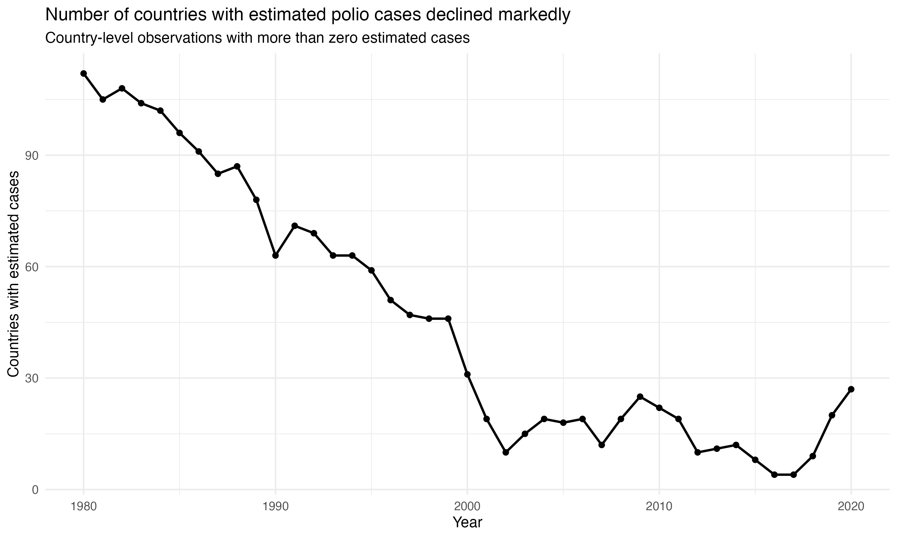

---

## Global estimated cases

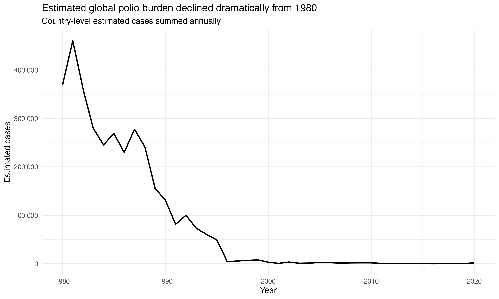

The eradication trajectory spans several orders of magnitude so the same series was also visualised on a logarithmic scale.

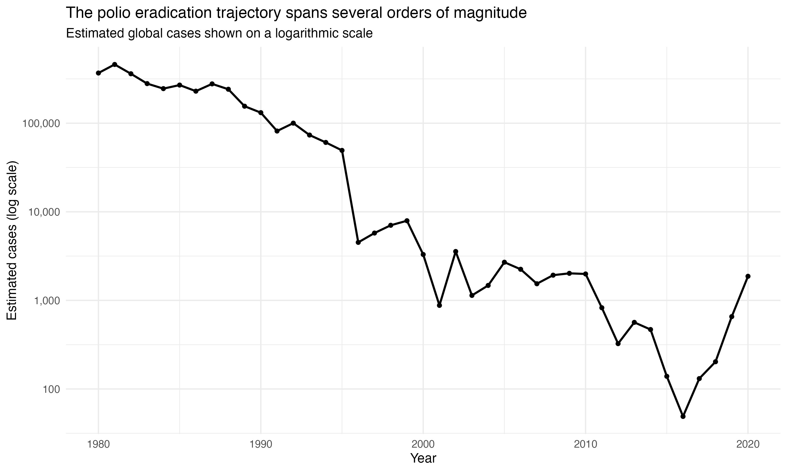

The logarithmic transformation makes long-term changes during the low-burden period easier to visualise.

---

## Countries reaching zero estimated cases

The proportion of observed countries with zero estimated cases rose over time.

In 1980:

```text
30.4%
```

of observed countries had zero estimated cases.

By 2016:

```text
97.7%
```

had zero estimated cases.

This proportion subsequently declined as positive estimated cases appeared in a larger number of countries.

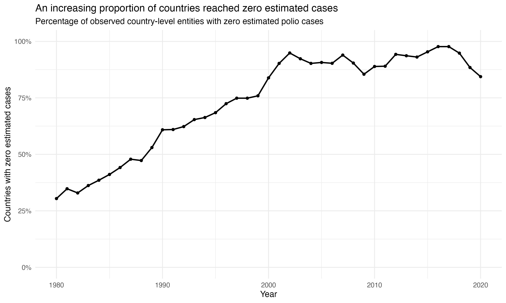

---

## Year-to-year changes

The eradication trajectory contained both periods of rapid decline and periods of increasing estimated burden.

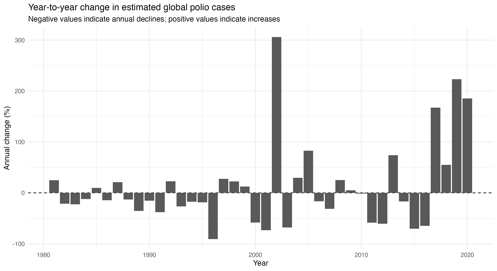

Annual percentage changes were examined alongside the overall trend rather than assuming a constant rate of decline.

---

# Structural change analysis

A single linear trend across 1980–2020 would not adequately describe the observed trajectory.

Structural change was formally assessed using the `strucchange` package.

The analysis used:

```text
log10(estimated cases + 1)
```

as the outcome.

A supF test provided strong evidence that the trajectory was not statistically stable across the study period:

```text
supF statistic = 27.7
p = 0.0000313
```

Candidate breakpoint models were compared using Bayesian Information Criterion.

| Number of breakpoints | BIC |
|---:|---:|
| 0 | 47.9 |
| 1 | 36.1 |
| 2 | 13.2 |
| 3 | 16.2 |
| 4 | 24.7 |
| 5 | 34.3 |

The lowest BIC occurred with two breakpoints.

The selected breaks occurred after:

```text
1995
2014
```

This produced three statistical phases:

| Phase | Years | Estimated annual change | R² |
|---|---|---:|---:|
| 1 | 1980–1995 | -13.2% | 0.914 |
| 2 | 1996–2014 | -12.2% | 0.651 |
| 3 | 2015–2020 | +82.9% | 0.763 |

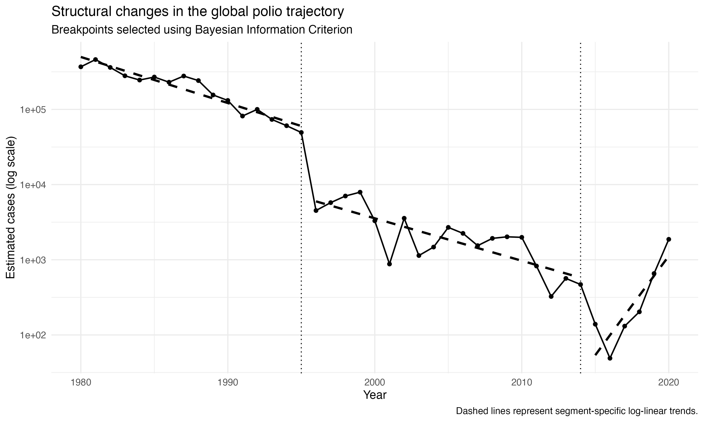

The first breakpoint seems to reflect a substantial level change alongside a change in the fitted trajectory.

Estimated cases fell from approximately 49,301 in 1995 to 4,517 in 1996.

The second breakpoint marked a transition from a declining fitted trajectory to an increasing one during the final study period.

The final segment contains six annual observations and begins from a low case count so the estimated +82.9% annual change should be interpreted cautiously.

Breakpoint detection identifies statistical change in the trajectory and it does not establish that a specific intervention or historical event caused the change.

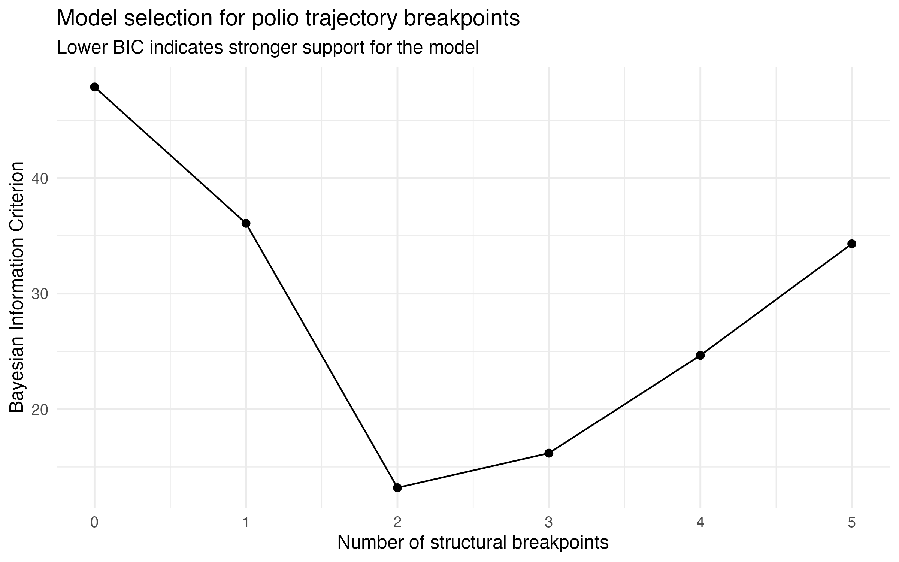

---

# Time to sustained zero estimated cases

A single year with zero estimated cases was not treated as equivalent to eradication.

The primary study endpoint was defined as:

```text
Five consecutive observed calendar years with zero estimated polio cases
after previously recording positive estimated cases.
```

The event was considered confirmed at the fifth consecutive zero year.

Countries that did not reach this endpoint before their final observation were right-censored.

---

## Kaplan–Meier analysis

Among countries that recorded at least one positive estimated case:

```text
149 countries entered the survival analysis
142 reached the five-year sustained-zero endpoint
7 were right-censored
```

Therefore:

```text
95.3% reached the primary sustained-zero endpoint
```

The median time from the first positive estimated case to confirmed sustained zero was:

```text
15 years
```

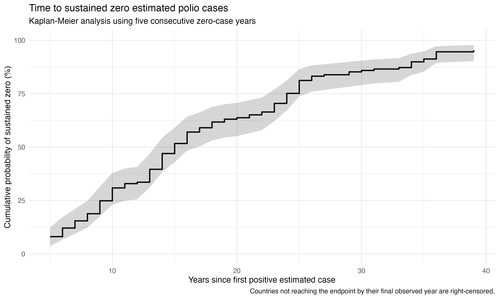

---

# Baseline burden and time to sustained zero

Countries were initially divided into three baseline-burden groups.

Kaplan–Meier curves were compared using a log-rank test.

The distributions differed substantially:

```text
Chi-square = 95.7
df = 2
p = 1.63 × 10^-21
```

This suggested that baseline estimated burden was strongly associated with the time required to reach the sustained-zero endpoint.

---

# Cox proportional hazards model

A Cox proportional hazards model was explored.

Baseline burden was log2 transformed so that the effect represented an approximate doubling in baseline estimated cases.

The fitted model produced:

```text
Hazard ratio = 0.757
95% CI = 0.711–0.807
p = 6.05 × 10^-18
```

The proportional hazards assumption was formally tested using Schoenfeld residuals.

```text
p = 0.00000545
```

Therefore, the constant hazard ratio was not used as the primary effect estimate.

This illustrates the importance of checking model assumptions rather than interpreting statistically significant model output automatically.

---

# Accelerated failure-time modelling

As a result of above, accelerated failure-time models were explored instead.

Four candidate distributions were compared using Akaike Information Criterion:

| Model | AIC |
|---|---:|
| Log-normal | 946 |
| Log-logistic | 949 |
| Weibull | 972 |
| Exponential | 1089 |

The log-normal model had the lowest AIC and was selected as the primary AFT model.

The estimated time ratio for each doubling of baseline estimated polio cases was:

```text
Time ratio = 1.14
95% CI = 1.12–1.17
p = 3.98 × 10^-34
```

This means that each doubling of baseline estimated burden was associated with approximately:

```text
14% longer time
```

to reach the five-year sustained-zero endpoint.

The difference in AIC between the log-normal and log-logistic models was relatively small, so the preference for the log-normal specification should not be interpreted as overwhelming evidence that it is uniquely correct.

---

# Sensitivity analysis

The definition of sustained zero was varied to examine whether results depended heavily on the five-year threshold.

| Consecutive zero years required | Countries reaching endpoint | Percentage | Median time |
|---:|---:|---:|---:|
| 3 years | 146 / 149 | 98.0% | 12 years |
| 5 years | 142 / 149 | 95.3% | 15 years |
| 10 years | 124 / 149 | 83.2% | 20 years |

Requiring a longer period of consecutive zero estimated cases reduced the number of countries reaching the endpoint and increased the median time required.

The overall finding that most countries eventually entered prolonged zero-case periods remained consistent across definitions.

---

# Recurrence after sustained zero

Among the 142 countries that reached the primary endpoint:

```text
65 later returned to a positive estimated case count
77 remained recurrence-free during observed follow-up
```

This corresponds to:

```text
45.8% experiencing recurrence
```

among countries with post-endpoint follow-up.

Among countries with recurrence, the median observed time to recurrence was:

```text
5 years
```

Recurrence was also analysed using Kaplan–Meier methods rather than relying on the crude proportion alone.

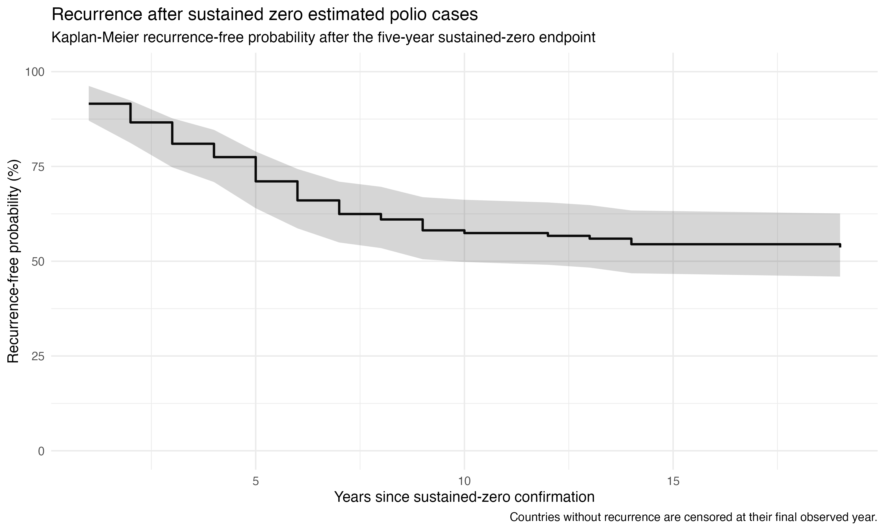

These recurrence events refer to transitions within the estimated case dataset.

They should not be interpreted as equivalent to formal loss of national eradication or elimination certification.

---

# Geographic concentration

The analysis examined whether estimated global burden became increasingly concentrated in a small number of countries.

For each year, each country's proportion of total estimated cases was calculated.

Geographic concentration was then quantified using the Herfindahl–Hirschman Index:

\[
HHI = \sum s_i^2
\]

where \(s_i\) represents a country's share of annual estimated cases.

Higher HHI values indicate greater concentration of burden in fewer countries.

---

## Concentration varied substantially over time

| Year | Estimated cases | Countries with cases | HHI | Effective number of countries | Largest country share |
|---|---:|---:|---:|---:|---:|
| 1980 | 368,410 | 112 | 0.165 | 6.06 | 36.1% |
| 1990 | 131,538 | 63 | 0.330 | 3.03 | 55.4% |
| 2000 | 3,297 | 31 | 0.115 | 8.72 | 21.5% |
| 2010 | 1,988 | 22 | 0.276 | 3.62 | 44.4% |
| 2016 | 49 | 4 | 0.332 | 3.01 | 46.9% |
| 2020 | 1,871 | 27 | 0.104 | 9.63 | 21.6% |

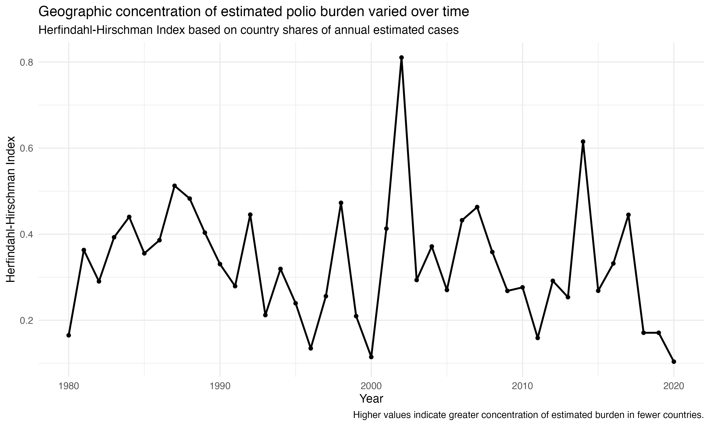

---

## Effective number of burden-contributing countries

The inverse of HHI provides an intuitive effective-number measure. Thus, an HHI corresponding to an effective number close to 1 indicates that annual burden was almost entirely concentrated in one country.

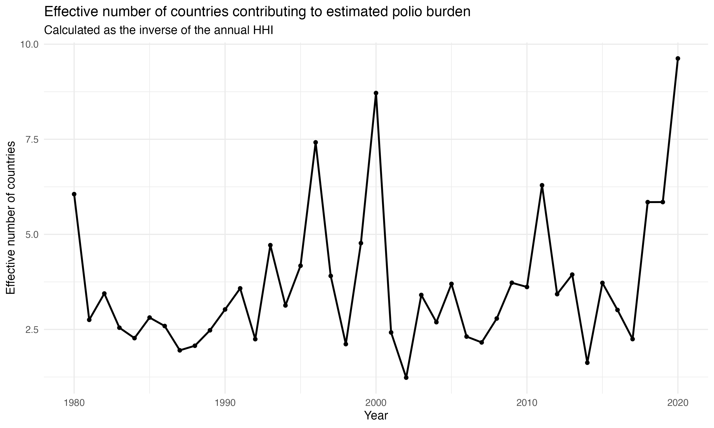

The most geographically concentrated year was 2002:

```text
HHI = 0.810
Effective number of countries = 1.23
```

India accounted for approximately:

```text
89.8%
```

of estimated cases that year.

Another highly concentrated year was 2014, when Pakistan accounted for approximately:

```text
77.6%
```

of estimated global cases.

---

## Leading-country burden shares

The share of burden contributed by the highest-burden countries was examined directly.

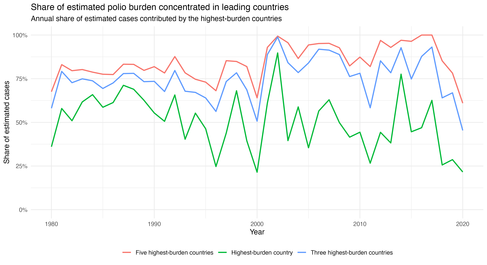

The dominant country changed substantially over time.

Examples include:

- India dominated much of the 1980s and 1990s
- Nigeria was the highest-burden country in several later years
- Congo accounted for the largest share in 2010
- Pakistan dominated in 2014–2016
- Syria contributed the largest estimated share in 2017
- Papua New Guinea was highest in 2018
- Pakistan was highest in 2019
- Afghanistan was highest in 2020

In 2020, estimated cases were distributed as follows:

| Country | Estimated cases | Share |
|---|---:|---:|
| Afghanistan | 404 | 21.6% |
| Pakistan | 243 | 13.0% |
| Chad | 202 | 10.8% |
| Democratic Republic of Congo | 162 | 8.7% |
| Burkina Faso | 130 | 7.0% |

---

# Burden versus geographic concentration

The relationship between total estimated burden and HHI was explored.

The Spearman correlation was:

```text
rho = 0.169
```

This suggests little evidence of a simple monotonic relationship between annual global case burden and geographic concentration across the full study period.

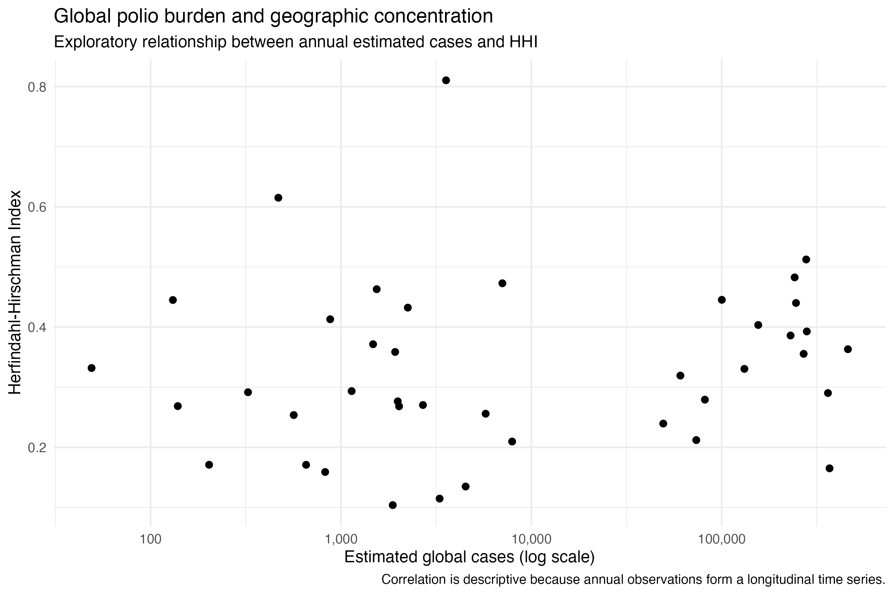

This correlation is descriptive because the annual observations form a longitudinal time series and are not statistically independent.

---

# Analytical workflow

## 01_data_audit.R

- temporal coverage
- missingness
- duplicate country-year observations
- aggregate entities
- zero-case observations
- negative estimated case counts
- extreme values
- country-level observation histories

---

## 02_data_cleaning.R

- standardising variable names
- excluding aggregate and OWID-specific entities
- retaining zero-case observations
- generating positive/zero case indicators
- creating annual global totals
- validating reconstructed country-level totals against the supplied World series
- identifying first observed zero-case years

---

## 03_eradication_trajectory.R

- estimated global case burden
- year-to-year percentage change
- number of countries with positive estimated cases
- proportion of countries with zero estimated cases
- minimum global burden
- post-minimum resurgence
- leading countries at key time points
- log-scale changes in the eradication trajectory

---

## 04_change_point_analysis.R

- supF testing
- breakpoint estimation
- BIC model selection
- breakpoint confidence intervals
- segment-specific log-linear regression
- annual percentage change estimates within each statistical phase

---

## 05_sustained_zero_and_recurrence.R

- Kaplan–Meier analysis
- right censoring
- log-rank testing
- Cox proportional hazards modelling
- Schoenfeld residual diagnostics
- accelerated failure-time modelling
- AIC-based model comparison
- 3-, 5- and 10-year sensitivity analyses
- Kaplan–Meier analysis of recurrence after sustained zero

---

## 06_geographic_concentration.R

- HHI
- inverse-HHI effective number of countries
- top-country burden share
- top-three burden share
- top-five burden share
- annual dominant-country identification
- exploratory burden-concentration correlation

---

# Repository structure

```text
polio-eradication/
│
├── data/
│   ├── raw/
│   │   └── 1- the-number-of-cases-of-infectious-diseases.csv
│   │
│   └── processed/
│       ├── polio_country.csv
│       ├── polio_annual_global.csv
│       ├── polio_annual_trajectory.csv
│       ├── polio_change_point_fitted.csv
│       ├── polio_sustained_zero_5year.csv
│       └── polio_country_burden_shares.csv
│
├── plots/
│   ├── 01_countries_with_estimated_polio_cases.png
│   ├── 02_global_polio_cases_over_time.png
│   ├── 03_global_polio_cases_log_scale.png
│   ├── 04_proportion_countries_zero_cases.png
│   ├── 05_annual_percentage_change.png
│   ├── 06_polio_change_point_analysis.png
│   ├── 07_breakpoint_model_selection.png
│   ├── 08_time_to_sustained_zero.png
│   ├── 09_recurrence_after_sustained_zero.png
│   ├── 10_polio_geographic_concentration_hhi.png
│   ├── 11_effective_number_polio_countries.png
│   ├── 12_polio_top_country_burden_shares.png
│   └── 13_global_burden_vs_concentration.png
│
├── tables/
│   └── analysis outputs
│
├── 01_data_audit.R
├── 02_data_cleaning.R
├── 03_eradication_trajectory.R
├── 04_change_point_analysis.R
├── 05_sustained_zero_and_recurrence.R
├── 06_geographic_concentration.R
│
└── README.md
```

---

# Epidemiological considerations

## Estimated cases are not equivalent to observed surveillance counts

The source outcome is explicitly labelled as:

```text
Total (estimated) polio cases
```

The analysis describes estimated burden rather than directly observed cases.

Interpretation should reflect the methods and assumptions used to construct the original estimates.

---

## Zero estimated cases are not equivalent to formal eradication

A country-year with zero estimated cases does not demonstrate formal national elimination or eradication.

The term 'sustained zero' in this project is an analytical definition based solely on consecutive annual values in the dataset.

It should not be confused with certification by international public health authorities.

---

## Recurrence refers to the estimated case series

A recurrence event means that a country returned to a positive estimated case count after satisfying the sustained-zero definition.

It does not by itself indicate that formal eradication status was lost.

---

## Structural breakpoints do not establish causality

Change-point analysis identifies years in which the statistical trajectory changed.

It does not establish why the change occurred.

---

## Model assumptions matter

The initial Cox model produced a highly statistically significant association between baseline burden and time to sustained zero.

The proportional hazards assumption was violated so the constant Cox hazard ratio was not used as the primary estimate.

An accelerated failure-time approach was used instead because it provided a more appropriate interpretation of the observed data.

---

## Sensitivity analysis

The definition of sustained zero is inherently methodological.

For this reason, 3-, 5- and 10-year definitions were compared.

Results should be interpreted alongside this sensitivity analysis rather than treating a single threshold as uniquely correct.

---

## Geographic concentration is dynamic

A declining global case count does not necessarily imply continuously increasing geographic concentration.

HHI and effective-country analyses showed substantial year-to-year variation.

The geographic distribution of remaining estimated burden needs to be considered alongside total global case counts.

---

# Statistical methods demonstrated

- data cleaning and validation
- missing-data assessment
- longitudinal descriptive epidemiology
- log transformation
- annual percentage change
- structural change testing
- breakpoint estimation
- BIC model selection
- segmented log-linear regression
- Kaplan–Meier estimation
- right censoring
- log-rank testing
- Cox proportional hazards modelling
- proportional hazards diagnostics
- Schoenfeld residual testing
- accelerated failure-time modelling
- AIC model comparison
- time-ratio interpretation
- endpoint sensitivity analysis
- recurrence analysis
- Herfindahl–Hirschman concentration indices
- effective-number measures
- exploratory rank correlation

---

# Tools

Analysis was conducted in R using packages:

```r
tidyverse
here
scales
strucchange
survival
```

Visualisations were produced using `ggplot2`.

---

# Reproducibility

To reproduce the analysis:

1. Clone the repository.
2. Open the project in R or RStudio.
3. Place the source CSV file in `data/raw/`.
4. Install the required R packages.
5. Run the scripts sequentially:

```r
source("01_data_audit.R")
source("02_data_cleaning.R")
source("03_eradication_trajectory.R")
source("04_change_point_analysis.R")
source("05_sustained_zero_and_recurrence.R")
source("06_geographic_concentration.R")
```

Processed datasets, tables and figures will be generated automatically in their respective directories.
